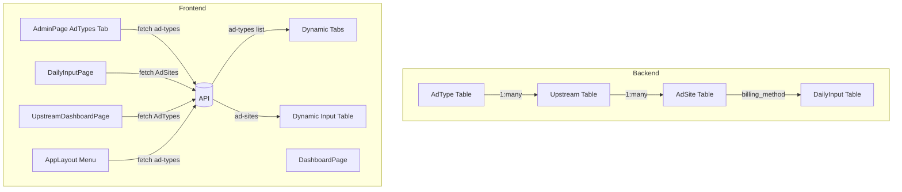

# Dynamic AdType Architecture Plan

## Problem Statement
Currently AdType codes (`SM`, `360`, `BAIDU_JS`, `OTHER`) are hardcoded throughout the frontend:
- `types/index.ts`: `AdTypeCode` union type
- `UpstreamDashboardPage.tsx`: `AD_TYPE_TABS` array
- `DailyInputPage.tsx`: hardcoded conditional rendering per adType
- `App.tsx`: hardcoded routes per adType
- `AppLayout.tsx`: hardcoded menu items per adType
- `i18n`: static keys for each adType

This prevents adding new AdTypes without code changes.

## Architecture Overview



## Key Changes

### 1. Types (`ads-management/src/types/index.ts`)

**Before:**
```typescript
export type AdTypeCode = 'SM' | '360' | 'BAIDU_JS' | 'OTHER'
```

**After:**
```typescript
export type AdTypeCode = string  // Allow any string, validated at runtime
export type BillingMethod = 'CPM' | 'RATIO'
```

### 2. Generic Input Table Component

Create a new `GenericInputTable` component that:
- Fetches AdSites filtered by upstream's AdType
- Renders columns based on each AdSite's `billing_method` (CPM vs RATIO)
- Handles batch save with appropriate payload per billing method

**Input Table Column Logic:**
```
CPM: qty, unit_price
RATIO: amount1, amount2, ratio_override
SM: + rebate_amount
```

### 3. DailyInputPage (`ads-management/src/pages/DailyInputPage.tsx`)

**Before:** Static conditional rendering per hardcoded adType
**After:** 
- Fetch AdTypes from API
- Build tabs dynamically from `adTypes` data
- Render one `GenericInputTable` that adapts to the selected AdType

### 4. Dynamic Tabs in UpstreamDashboardPage

**Before:**
```typescript
const AD_TYPE_TABS = [
  { key: 'tab-sm', adType: 'SM', labelKey: 'adType.gsSm' },
  { key: 'tab-360', adType: '360', labelKey: 'adType.360' },
  // ...
]
```

**After:** Fetch from `/api/admin/ad-types` and build tabs dynamically

### 5. Dynamic Routes in App.tsx

**Current:** Hardcoded routes like `/input/sm`, `/input/360`, etc.
**After:** Use a wrapper component that fetches AdType from URL param and renders GenericInputPage

### 6. Dynamic Menu in AppLayout

Fetch AdTypes and build menu items dynamically.

### 7. DashboardPage

Similarly, build AD_TYPE_TABS and columns dynamically from API.

## Implementation Steps

### Phase 1: Core Generic Input Table
1. Create `ads-management/src/components/daily-input/GenericInputTable.tsx`
   - Fetches AdSites by AdType
   - Adapts columns per row's billing_method
   - Handles save mutation generically

2. Modify `DailyInputPage.tsx` to use GenericInputTable

### Phase 2: Dynamic AdType Loading
3. Modify `UpstreamDashboardPage.tsx` to fetch AdTypes dynamically
4. Modify `DashboardPage.tsx` similarly
5. Update `AppLayout.tsx` menu to be dynamic

### Phase 3: Dynamic Routing
6. Simplify `App.tsx` routes to use dynamic matching
7. Add API endpoint to get AdType by code

### Phase 4: Cleanup
8. Remove hardcoded AdType references
9. Keep specialized input tables if needed for backward compat (optional)

## Files to Modify

| File | Change |
|------|--------|
| `ads-management/src/types/index.ts` | Change `AdTypeCode` to `string` |
| `ads-management/src/components/daily-input/GenericInputTable.tsx` | New - generic input component |
| `ads-management/src/pages/DailyInputPage.tsx` | Use GenericInputTable, dynamic tabs |
| `ads-management/src/pages/UpstreamDashboardPage.tsx` | Dynamic AD_TYPE_TABS |
| `ads-management/src/pages/DashboardPage.tsx` | Dynamic AD_TYPE_TABS |
| `ads-management/src/components/layout/AppLayout.tsx` | Dynamic menu |
| `ads-management/src/App.tsx` | Simplify routes |
| `ads-management/src/api/axios.ts` | Add ad-types query helper |

## Data Flow

```
1. User navigates to /input/{adTypeCode}
2. DailyInputPage loads, fetches AdSites where upstream.ad_type_code = adTypeCode
3. For each AdSite row, GenericInputTable checks billing_method:
   - CPM → show qty + unit_price inputs
   - RATIO → show amount1 + amount2 + ratio inputs
4. On save, batch POST with records containing appropriate fields
5. Backend validates and saves to DailyInput table
```

## Backward Compatibility

- AdType codes in existing routes (`/input/sm`, `/input/360`) will still work
- Old specialized input tables can coexist temporarily
- i18n keys for adType names should fallback to code if label not found

## New API Endpoints Needed

1. `GET /api/admin/ad-types` - already exists, returns all AdTypes
2. `GET /api/ad-types/:code` - get single AdType by code
3. `GET /api/daily-input?date=&ad_type=` - already filters by ad_type

## Validation

- AdType code must be 2-20 chars, alphanumeric + underscore
- Code must be unique
- Cannot delete AdType with associated upstreams